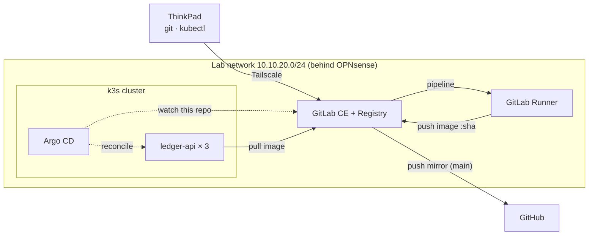

# platform

> The GitOps config repo for my self-hosted Kubernetes platform. Argo CD keeps a
> two-node k3s cluster matching what's in this repo, so **a merge to `main` is the
> deploy**. Nobody runs `kubectl apply` by hand.

## The problem
In many teams, what's running in production is whatever someone last applied from
their laptop or clicked in a console. There's no reliable record of what runs,
drift goes unnoticed, and rollback means guessing. For regulated companies (for
example fintechs under the EU's DORA), untraceable change is a compliance problem
as well as an operational one.

This repo makes Git the single source of truth: every change to the cluster is a
reviewed commit, and the cluster corrects itself back to Git if anything drifts.

## What I built
Everything runs on one always-on mini PC (Proxmox VE), built up in stages:

- **Segmented network:** an isolated lab network (`10.10.20.0/24`) behind an
  OPNsense firewall, with no management ports exposed to the internet.
- **Self-hosted CI/CD:** GitLab CE with a container registry and a runner.
  Pipelines lint, test and build images tagged with the commit SHA.
- **Kubernetes:** a two-node k3s cluster (control plane + worker) cloned from a
  cloud-init VM template.
- **GitOps:** Argo CD watches this repo with automated sync, `prune` and
  `selfHeal`.
- **A real workload:** [`ledger-api`](https://github.com/esoung11/ledger-api), a
  Flask service running 3 replicas as a non-root user, with health probes,
  resource limits and a pinned image.
- **Remote access:** Tailscale subnet router, so the lab is reachable from
  anywhere without port forwarding (the home connection is double-NAT'd).
- **Off-site copy:** GitLab push-mirrors `main` to GitHub, using a separate
  deploy key per repo, scoped to that one repo.

## Architecture



Full detail, data flows and trust boundaries: [docs/architecture.md](docs/architecture.md).

## How a change ships
There are two repos with two kinds of change (see [ADR-0003](docs/adr/0003-manifests-in-config-repo.md)):

1. **App code** (`ledger-api`): push → CI lints, tests and builds → image pushed as
   `ledger-api:<short-sha>`.
2. **What runs** (this repo): change the image tag or replicas in
   `apps/ledger-api/` → merge request → merge to `main` → Argo CD syncs the cluster
   within a few minutes.

Rolling back is a `git revert` of the manifest change.

## What I've verified
- Scaling `replicas` 2 → 3 in Git, with no `kubectl`: the cluster followed on its own.
- Found the cluster running a two-day-old image while `:latest` had moved on
  (digest `d79aacf` running vs `aaeb96f` published). Pinned the image to its
  SHA tag, merged, and all pods rolled to `c0935b12`
  ([ADR-0006](docs/adr/0006-pin-images-by-sha-tag.md)).
- Scanned the full Git history of every repo with Gitleaks before publishing,
  plus a search for committed Kubernetes Secrets: clean
  ([ADR-0008](docs/adr/0008-rewrite-history-to-noreply-identity.md)).

## Repo layout
```text
apps/ledger-api/     Deployment + Service for ledger-api (namespace: ledger)
argocd/              Argo CD Application definitions (Argo's own config, in Git)
docs/architecture.md Components, data flows, trust boundaries
docs/adr/            Architecture decision records
```

## Key decisions
| ADR | Decision |
|---|---|
| [0001](docs/adr/0001-record-architecture-decisions.md) | Record architecture decisions as ADRs |
| [0002](docs/adr/0002-use-k3s-for-kubernetes.md) | Use k3s as the Kubernetes distribution |
| [0003](docs/adr/0003-manifests-in-config-repo.md) | Keep manifests in a config repo, separate from app code |
| [0004](docs/adr/0004-use-argocd-for-gitops.md) | Use Argo CD for GitOps |
| [0005](docs/adr/0005-use-tailscale-for-remote-access.md) | Use Tailscale for remote access |
| [0006](docs/adr/0006-pin-images-by-sha-tag.md) | Pin images by SHA tag, not `:latest` |
| [0007](docs/adr/0007-push-mirror-to-github-with-deploy-keys.md) | Push-mirror to GitHub with per-repo deploy keys |
| [0008](docs/adr/0008-rewrite-history-to-noreply-identity.md) | Scan and rewrite history before publishing |

## Security in the design
- Network segmentation: the lab has no direct uplink; OPNsense controls all traffic.
- No exposed management ports; remote access only over Tailscale.
- Least-privilege credentials: read-only tokens for Argo CD and image pulls; one
  deploy key per GitHub repo; short-lived CI job tokens in pipelines.
- Containers run as non-root (`runAsNonRoot`, UID 1000) with resource limits.
- Git history scanned for secrets; commit identities use a GitHub noreply address.

## Things that broke (and the fix)
- **CI jobs stuck "pending":** the runner was locked to one project. Made it a
  shared instance runner.
- **`ImagePullBackOff` on one node:** k3s on the server node was never restarted
  after adding `registries.yaml`, so it still demanded HTTPS. Restarted k3s.
- **Argo CD couldn't read the repo:** GitLab deploy tokens were rejected; a project
  access token worked.
- **Sudden `403` on push:** git had cached the read-only token and used it to
  push. Removed it from the credential store.
- **Argo CD install failed:** a large CRD exceeded the annotation size limit.
  Fixed with `kubectl apply --server-side`.

## Known limitations (honest homelab trade-offs)
- Single control-plane node: no control-plane high availability.
- The registry is plain HTTP inside the lab network.
- CI builds images with privileged Docker-in-Docker (to be replaced with Kaniko).
- Image tags are bumped in this repo by hand (to be automated).
- No backups, monitoring or alerting yet.

## What's next
- Supply-chain security: Kaniko builds, SBOMs, image signing, and Kyverno
  admission control so only signed images can run.
- Observability and resilience: Prometheus, Grafana, Loki, SLOs, chaos tests and
  automated restore drills.
- Terraform for the homelab, then the same patterns on AWS.
