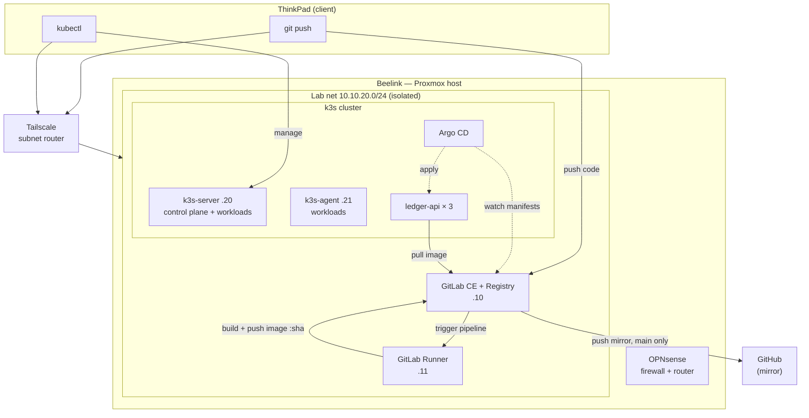

# Architecture — homelab platform

_Last updated: 2026-09-29 (k3s + Argo CD live; Tailscale remote access; GitHub mirror)_

## Overview
A self-hosted CI/CD + Kubernetes platform on a single Proxmox host (the Beelink).
Code is pushed to a self-hosted GitLab, built into a container image by a GitLab
Runner, and deployed to a k3s cluster by Argo CD, which reconciles the cluster
against the manifests in this repo. GitLab push-mirrors `main` of each repo to
GitHub as an off-site, public copy.

## Components
- **ThinkPad** — client only. Joins the tailnet (`--accept-routes`) to reach the lab network; runs `git` and `kubectl`.
- **Tailscale subnet router** (on the Beelink) — advertises `10.10.20.0/24` to the tailnet, so no inbound ports are needed ([ADR-0005](adr/0005-use-tailscale-for-remote-access.md)).
- **OPNsense** — firewall/router between the management network (vmbr0) and the isolated lab network (vmbr1, `10.10.20.0/24`); provides DHCP + outbound NAT.
- **GitLab CE + Container Registry** (`10.10.20.10`, registry on `:5050` over HTTP) — Git remote, CI/CD, image store, and source of truth for Argo CD.
- **GitLab Runner** (`10.10.20.11`) — shared instance runner with the Docker executor; builds images with Docker-in-Docker.
- **k3s cluster** — `k3s-server` (`10.10.20.20`, control plane + workloads) and `k3s-agent` (`10.10.20.21`, workloads). Both nodes trust the HTTP registry via `/etc/rancher/k3s/registries.yaml`.
- **Argo CD** (namespace `argocd`) — watches `apps/` in this repo on `main`; automated sync with `prune` and `selfHeal` ([ADR-0004](adr/0004-use-argocd-for-gitops.md)).
- **ledger-api** (namespace `ledger`) — 3 replicas, `ClusterIP` Service on port 80 → 8000, image pinned by short-SHA tag ([ADR-0006](adr/0006-pin-images-by-sha-tag.md)).
- **GitHub** (`github.com/esoung11`) — push-mirror target for `main` of each repo ([ADR-0007](adr/0007-push-mirror-to-github-with-deploy-keys.md)).

## Diagram

## Data flows
**Shipping a new app version**
1. Push to `ledger-api` → pipeline runs lint (ruff) → test (pytest) → build.
2. The runner pushes `ledger-api:<short-sha>` to the registry (plus `:latest` on `main`).
3. A merge request in this repo changes the image tag in `apps/ledger-api/deployment.yaml`.
4. On merge, Argo CD detects the new commit on `main` and applies it.
5. Kubernetes rolls out new pods, which pull the image using the `gitlab-registry` pull secret.

**Off-site copy**
1. Any update to a protected branch (`main`) in GitLab triggers the push mirror.
2. GitLab pushes over SSH to GitHub with that repo's deploy key.

## Trust boundaries
| Boundary | Crosses from → to | Protected by |
|---|---|---|
| Remote access | Any network → lab net | Tailscale (WireGuard, device-authenticated); no exposed ports |
| Lab perimeter | Home LAN → lab net | OPNsense firewall; vmbr1 has no physical uplink |
| CI → registry | Pipeline job → registry | Ephemeral `CI_JOB_TOKEN` per job. Weak point: privileged Docker-in-Docker |
| Cluster → registry | Nodes → registry | Read-only pull secret. Weak point: plain HTTP (lab-internal only) |
| Argo CD → Git | Cluster → GitLab | Read-only project access token (`read_repository`) |
| GitLab → GitHub | Lab → internet | Per-repo SSH deploy key; GitHub host key verified against published fingerprints |
